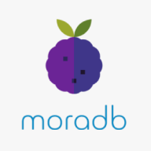

moraes is an `event` store capable of streaming future events to every client subscribed to the relative `category`.
An `event` is a single piece of information stored in moraes, with some basic properties:
- `id`, unique id
- `category`, field that describe what category owns the event
- `createdAt` timestamp defining when the event was created
- `fireAt` timestamp defining when the event should be fired
- `data`, custom data field
- `name`, optional event name

## How does it work?

Clients connect to the database via a connection string, subsequently a client can schedule an event:
```json
"event": {
    "createdAt": 1603140122,
    "fireAt": 1603140222,
    "category": "categoryName",
    "data": {
        "field": "value"
    },
    "name": "event"
};
```
`moraes.schedule(event);`
moraes then proceeds to do the following:

1) Check if the `fireAt` time is contained inside the `TemporalQueue` time range, if so then it will place it in order inside it.
2) Store the event inside a persistent database with a queued flag based upon the former step.
